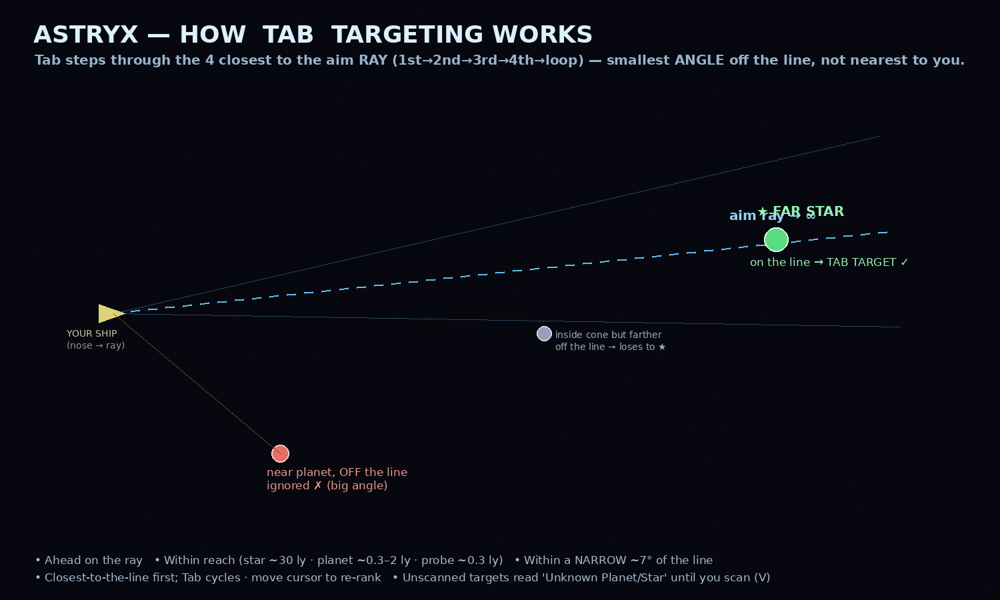

# Astryx — How Tab Targeting Works

## The idea

Press **Tab** to lock a navigation target. It does **not** grab the nearest object to your
ship. Instead it draws a **narrow, long ray straight out of the nose** (right through the
crosshair), extends it far ahead, and locks onto whatever sits **nearest that line**.

> "Whoever is near the *ray*, not near *me*."

## Cycling the 4 closest

The ray finds the **up-to-4 objects closest to the line** and Tab steps through them:

- **1st Tab** → the *absolute* closest to the ray line
- **2nd Tab** → 2nd closest · **3rd** → 3rd · **4th** → 4th
- **5th Tab** → loops back to the closest

**Move the cursor** and the ranking re-computes — a noticeable aim change restarts the cycle
from the new closest. Aim at empty space and Tab clears the lock.

## How the pick is made

For every star, planet, moon, probe and known wormhole, Tab checks three things:

1. **In front of you** — ahead along the ray (behind-you objects are ignored).
2. **Within reach** — the ray is *long*, with per-kind reach:
   | Kind | Reach |
   |------|-------|
   | Star | ~30 ly |
   | Planet | ~0.3–2 ly (by size) |
   | Moon | ~0.6 ly |
   | Probe / craft | ~0.3 ly |
3. **Near the line** — within **~7°** of the ray (a *narrow* beam, so a near planet off to
   the side is **not** picked).

The qualifiers are ranked by **angle off the line** (closest first); Tab walks that list.

## Unknown until scanned

If the target **hasn't been scanned yet**, Tab shows it as **"Unknown Planet" / "Unknown
Star" / …** — not its real name. Fly over and **scan (V)** to reveal what it actually is.

## Why *angle*, not raw distance to the line

"Near the line" is measured as an **angle**, because the ray is long/infinite. A far star you
point dead at has a tiny angle and wins — even though, in raw metres, the ray passes *closer*
to a near planet off to the side. Using angle keeps Tab on **what the crosshair points at**.

## Where it lives

`main.gd → _aim_ranked()` (the ray's 4 closest), `_cycle_nav_target()` (the Tab cycle),
`_tab_display_name()` (the Unknown labels). Regenerate the diagram with
`python3 tools/draw_tab_target.py`.
