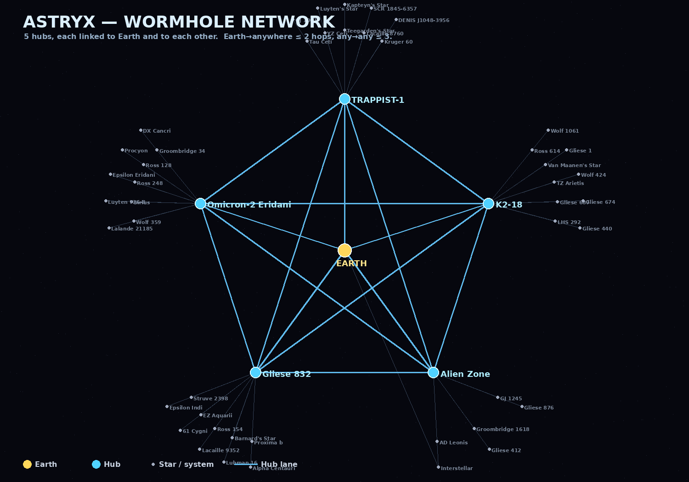

# Astryx — Wormhole Network



## Why wormholes exist (a love letter to not flying for 3 real hours)

Space is, scientifically speaking, *stupidly* big. The nearest star is 4.2 light-years away.
At sublight that's a commute measured in "go make a sandwich, come back, still flying." We
tried it. It was less "majestic interstellar voyage" and more "staring at a dot that refuses
to get bigger while your engine hums you into a coma."

So we did what any reasonable space agency would do when faced with crushing cosmic boredom:
we **punched holes in spacetime** and called it infrastructure. You're welcome.

## How the network is built

Instead of one mega-gate that everything plugs into (a single glorious traffic jam), the
network uses **5 hubs**, spread out across the field:

- **TRAPPIST-1, K2-18, Omicron-2 Eridani, Gliese 832, Alien Zone**
- Every hub is wired straight to **Earth**, and **to every other hub**.
- Every other star hangs off its **nearest hub** as a spoke, balanced so no single hub
  hoards the whole map (each carries ~10 systems, not all 50).

## The guarantee

Because of that layout, the worst trip is short:

| Trip | Hops |
|------|------|
| Earth → any hub | **1** |
| Earth → any star | **≤ 2** |
| Any star → any star | **≤ 3** |

So you're never more than **3 wormholes** from anywhere. No 10-hop pilgrimages, no
"connecting flight through six red dwarfs." Point, jump, arrive, gloat.

## Verification

This isn't vibes — it's tested. `tools/test_wh_network.gd` builds the live graph from
`SystemDB`, BFS-checks reachability and hop counts, and asserts:

```
connected:        PASS
Earth <= 3 hops:  PASS   (max 2)
any <= 3 hops:    PASS   (diameter 3)
```

## Regenerating this doc

```bash
# 1. run the test (prints the report)
godot --headless --script res://tools/test_wh_network.gd

# 2. dump the graph + redraw the diagram
godot --headless --script res://tools/export_wh_graph.gd   # -> /tmp/wh_graph.json
python3 tools/draw_wh_network.py                            # -> WORMHOLE_NETWORK.png
```

*Hubs are chosen automatically (farthest-point spread + balanced spoke caps), so if the star
catalogue changes, re-run the steps above and the network + this picture update themselves.*
